## IF
Definition: The IF function in Excel is a logical function that checks whether a condition is TRUE or FALSE, and then returns one value if the condition is TRUE and another value if the condition is FALSE.
Syntax: =IF(logical_test, value_if_true, value_if_false)
Example: =IF(C2>=50,"Pass","Fail")
Practice: 1) Create Pass/Fail column for students.
Practice: 1) Create Scholarship column for students who scored >=80  marks in exam.

[Open IF_examples Sheet in Excel](../excel_files/formula_examples.xlsx)
> After opening, go to the sheet named `IF_examples` to see the formulas.

## IFS
Definition: The IFS function in Excel evaluates multiple conditions in the order they are written and returns a value corresponding to the first TRUE condition. It is useful when you have more than one condition to test, instead of nesting multiple IF statements.

Syntax: 
=IFS(condition1, value_if_true1, condition2, value_if_true2, ..., TRUE, value_if_false)

Example: 
=IFS(C2>=90,"A", C2>=75,"B", C2>=60,"C", C2>=50,"D", TRUE,"F")

Practice: 1) Create a Grade column for students based on their marks:
- Marks >= 90 → "A"
- Marks >= 75 → "B"
- Marks >= 60 → "C"
- Marks >= 50 → "D"
- Marks < 50 → "F"

Practice: 2) Create a Performance column for students:
- Marks >= 85 → "Excellent"
- Marks >= 70 → "Good"
- Marks >= 50 → "Average"
- Marks < 50 → "Needs Improvement"

[Open IFS_examples Sheet in Excel](../excel_files/formula_examples.xlsx)
> After opening, go to the sheet named `IFS_examples` to see the formulas.

## AND

Definition: The AND function in Excel is a logical function that checks whether all conditions are TRUE. It returns TRUE if all conditions are met, and FALSE if any condition is not met.

Syntax: =AND(logical1, logical2, …)

Example: =AND(C2>=50, D2="Yes")

Practice: 1) Create a column that shows Eligible only if a student scored at least 50 marks and has submitted the assignment.

Practice: 2) A school wants to check if students are eligible for a certificate.
- Student must score at least 60 marks.
- Student must have attendance ≥ 75%.
If both conditions are met, display "Certificate Awarded", otherwise display "Not Awarded".

[Open AND_examples Sheet in Excel](../excel_files/formula_examples.xlsx)
> After opening, go to the sheet named `AND_examples` to see the formulas.

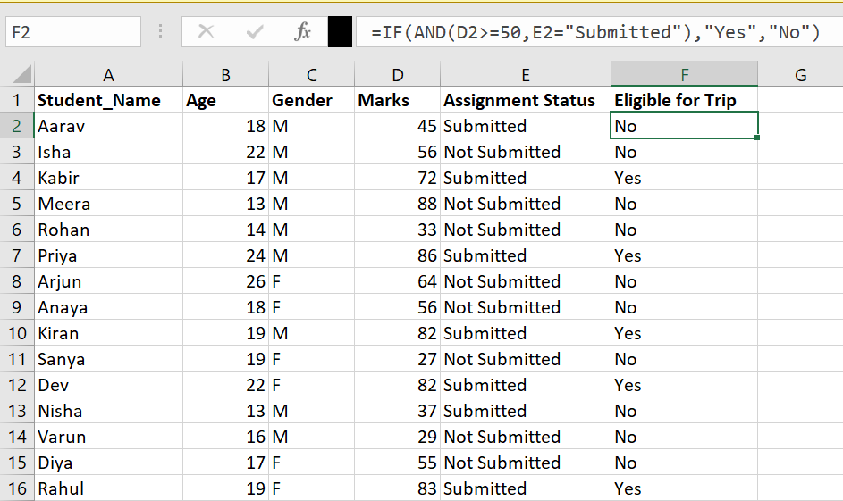

## OR

Definition: The OR function in Excel is a logical function that checks whether at least one condition is TRUE. It returns TRUE if any condition is met, and FALSE only if all conditions are FALSE.

Syntax: =OR(logical1, logical2, …)

Example: =OR(C2>=80, D2="Yes")

Practice: 1) Create a column that shows Extra Credit if a student scored at least 80 marks or has submitted assignment.

Practice: 2) A school wants to give a Warning to students if either condition is TRUE:
Student scored less than 40 marks.
Student has attendance below 60%.
If any condition is met, display "Warning", otherwise display "OK".

[Open OR_examples Sheet in Excel](../excel_files/formula_examples.xlsx)
> After opening, go to the sheet named `OR_examples` to see the formulas.

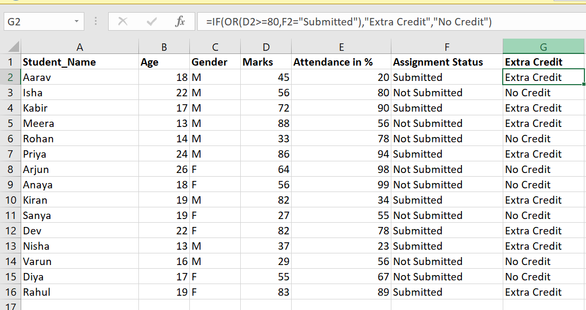
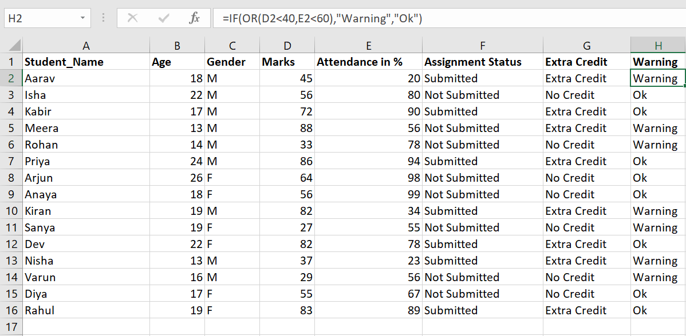

## SUM

Definition: The SUM function in Excel is used to add numbers together. It can add individual numbers, cell references, ranges, or a mix of all three.

Syntax:
=SUM(number1, [number2], …)

Example:
=SUM(B2:B6)

Practice: 1) Create a column that calculates the Total Marks obtained by each student across 3 subjects.

Practice: 2) Create a cell that calculates the Class Total Marks (sum of all students’ total marks).

[Open SUM_examples Sheet in Excel](../excel_files/formula_examples.xlsx)
> After opening, go to the sheet named `SUM_examples` to see the formulas.

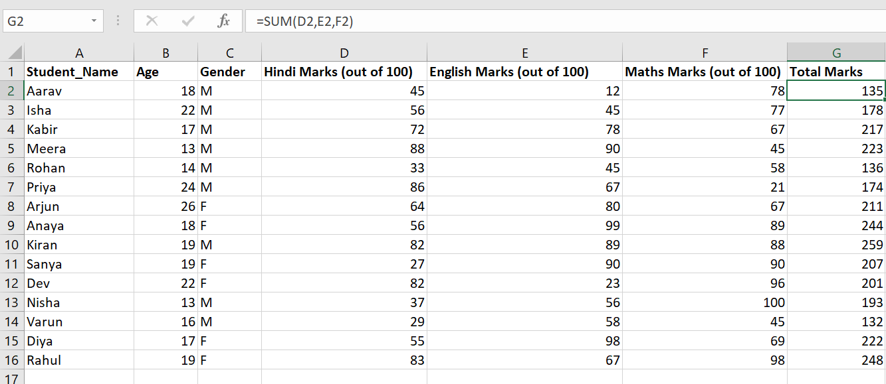
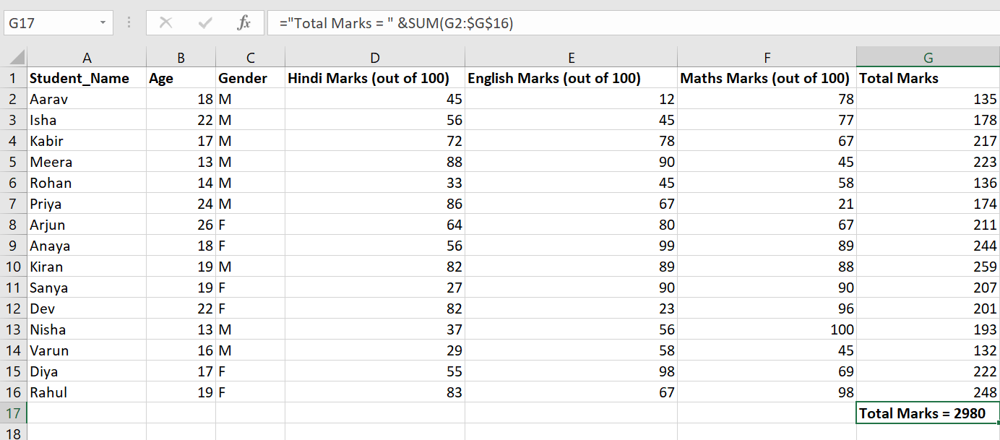

## SUMIF

Definition: The SUMIF function in Excel adds all numbers in a range that meet a specified condition. It is useful for summing only the values that satisfy certain criteria.

Syntax:
=SUMIF(range, criteria, [sum_range])

- range – The cells you want to evaluate the condition on.
- criteria – The condition that determines which cells to sum.
- sum_range – The cells to actually sum (optional; if omitted, range is summed).

Example:
=SUMIF(B2:B11, ">=80", B2:B11)

Practice: 1) Sum the marks of students who scored at least 50 in Maths. 

Practice: 2) Sum the Science marks of students whose attendance is ≥ 75%.

[Open SUMIF_examples Sheet in Excel](../excel_files/formula_examples.xlsx)
> After opening, go to the sheet named `SUMIF_examples` to see the formulas.

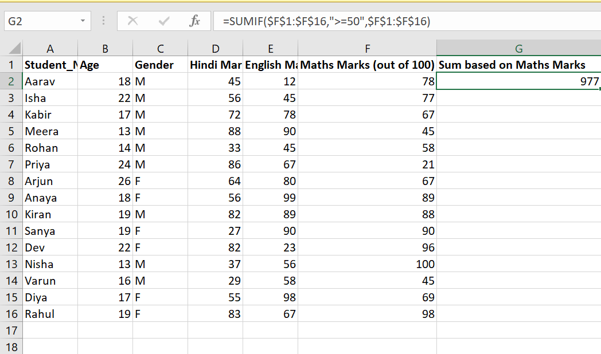
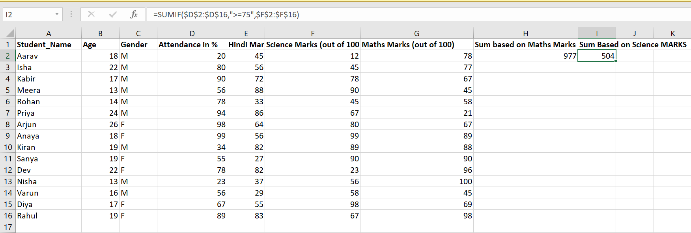

## SUMIFS

Definition: The SUMIFS function in Excel adds all numbers in a range that meet multiple specified conditions. It is useful when you want to sum values based on more than one criterion.

Syntax:
=SUMIFS(sum_range, criteria_range1, criteria1, [criteria_range2, criteria2], …)

- sum_range – The cells to sum.
- criteria_range1 – The first range to evaluate the condition on.
- criteria1 – The condition that determines which cells in criteria_range1 to sum.
- criteria_range2, criteria2, … – Additional ranges and conditions (optional).

Example:
=SUMIFS(C2:C11, B2:B11, ">=80", D2:D11, "Pass")

Practice: 1) Sum the Maths marks of students who scored at least 50 and have attendance ≥ 75%. 

Practice: 2) Sum the Science marks of students who scored ≥ 60 and belong to class "10A".

[Open SUMIFS_examples Sheet in Excel](../excel_files/formula_examples.xlsx)
> After opening, go to the sheet named `SUMIFS_examples` to see the formulas.

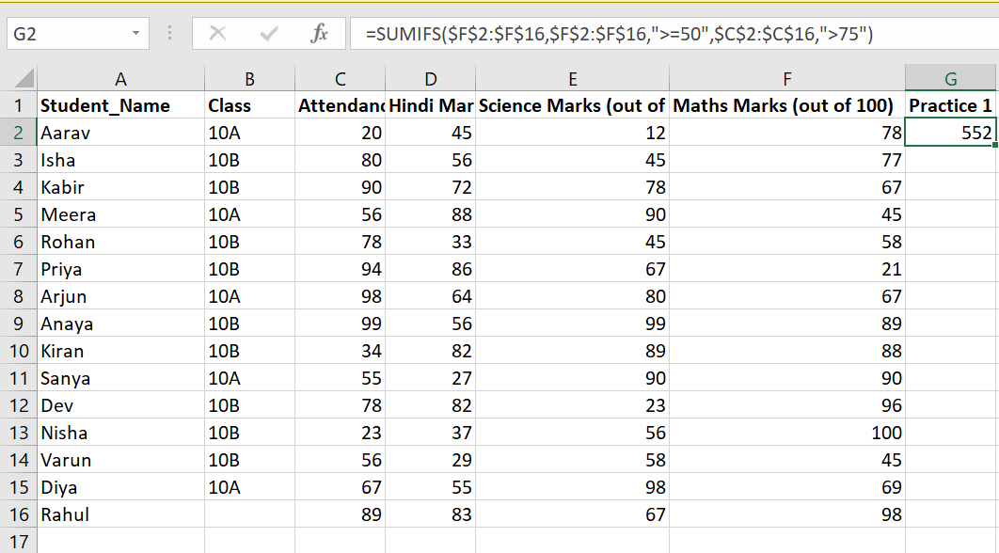
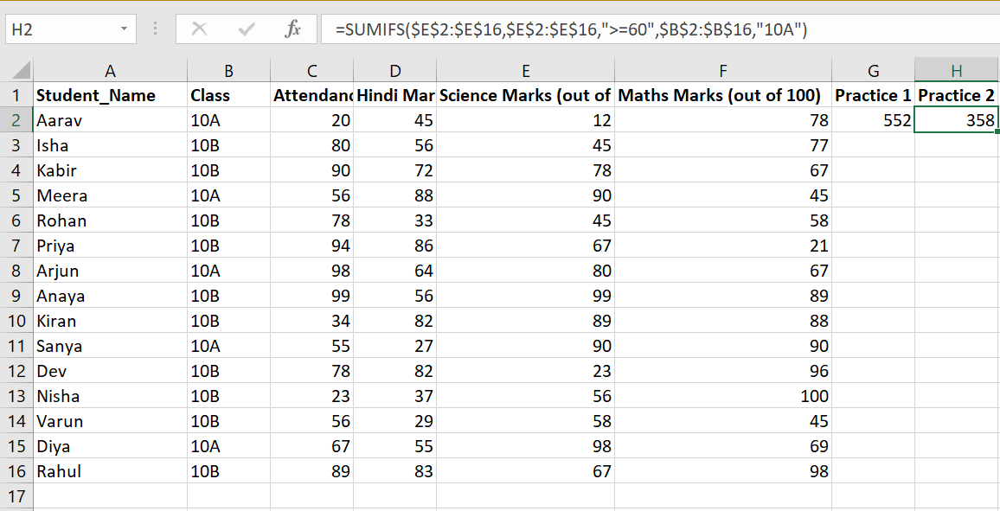

## COUNT

Definition: The COUNT function in Excel counts the number of numeric values (numbers, dates, times) in a range. It ignores blank cells and text.

Syntax:
=COUNT(value1, [value2], …)

- value1 – The first cell, range, or value to count.
- value2, … – Additional cells, ranges, or values (optional).

Example:
=COUNT(A2:A11)

Practice: 1) Count how many students have marks entered in the Maths column. 

Practice: 2) Count how many students have marks entered in the Science column.

[Open COUNT_examples Sheet in Excel](../excel_files/formula_examples.xlsx)
> After opening, go to the sheet named `COUNT_examples` to see the formulas.

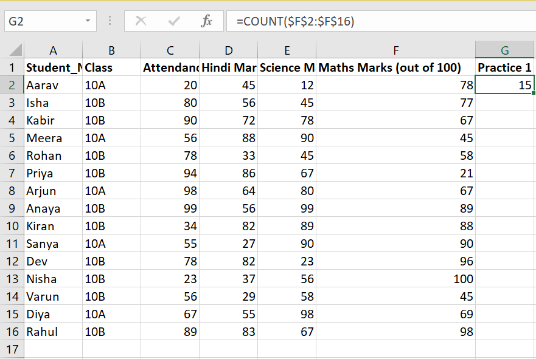
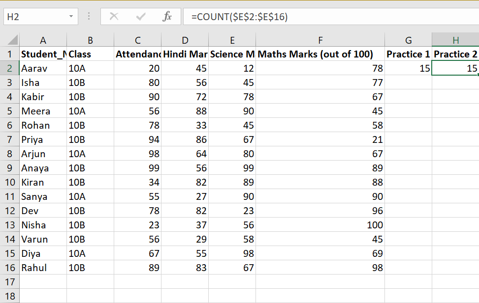

## COUNTA

Definition: The COUNTA function in Excel counts the number of non-empty cells in a range. It includes numbers, text, logical values, errors, and formulas that return a value, but ignores blank cells.

Syntax:
=COUNTA(value1, [value2], …)

- value1 – The first cell, range, or value to check.
- value2, … – Additional cells, ranges, or values (optional).

Example:
=COUNTA(A2:A11)

Practice: 1) Count how many students have their names entered in the list.

Practice: 2) Count how many subjects have marks recorded (Maths, Science, English, etc.).

[Open COUNTA_examples Sheet in Excel](../excel_files/formula_examples.xlsx)
> After opening, go to the sheet named `COUNTA_examples` to see the formulas.

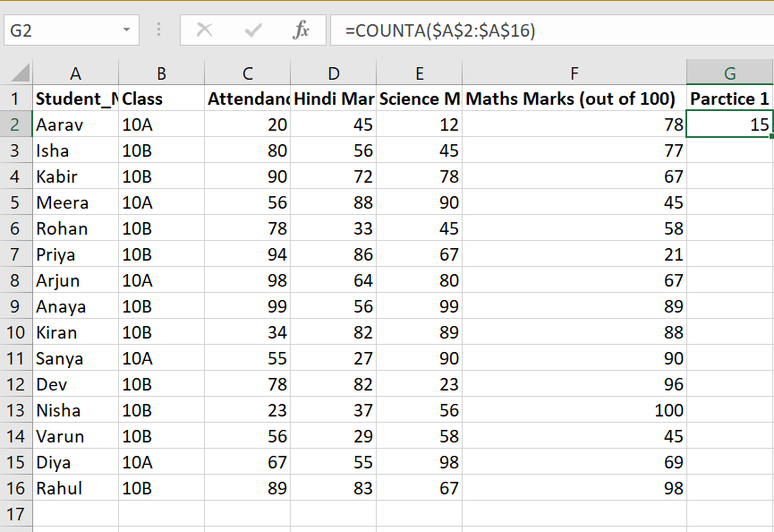
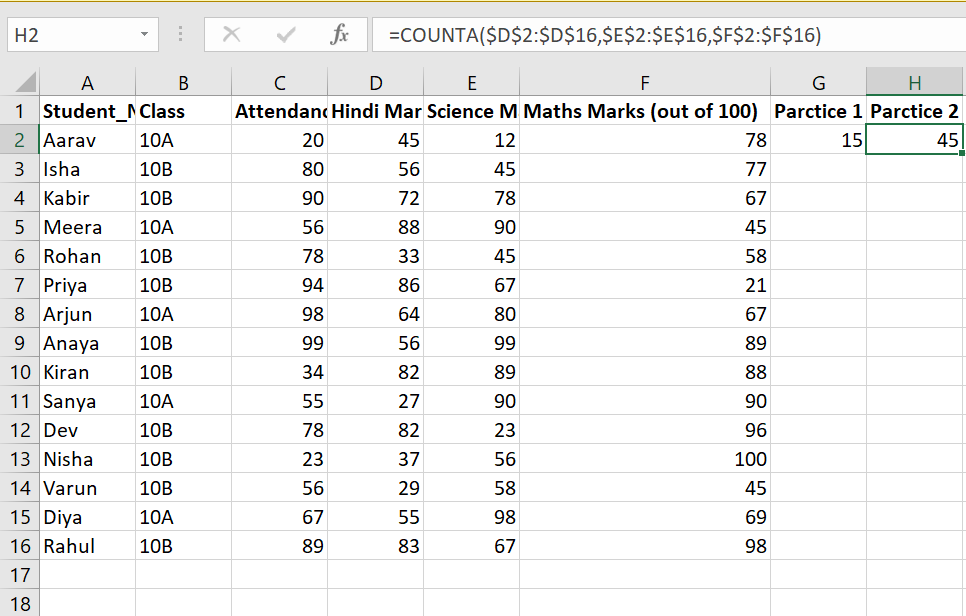

## COUNTIF

Definition: The COUNTIF function in Excel counts the number of cells in a range that meet a single specified condition. It is useful when you want to count entries based on one criterion.

Syntax:
=COUNTIF(range, criteria)

- range – The range of cells you want to evaluate.
- criteria – The condition that determines which cells to count (number, expression, or text).

Example:
=COUNTIF(B2:B11, ">=80")

Practice: 1) Count the number of students who scored at least 50 in Maths.

Practice: 2) Count the number of students who belong to class "10A".

[Open COUNTIF_examples Sheet in Excel](../excel_files/formula_examples.xlsx)
> After opening, go to the sheet named `COUNTIF_examples` to see the formulas.

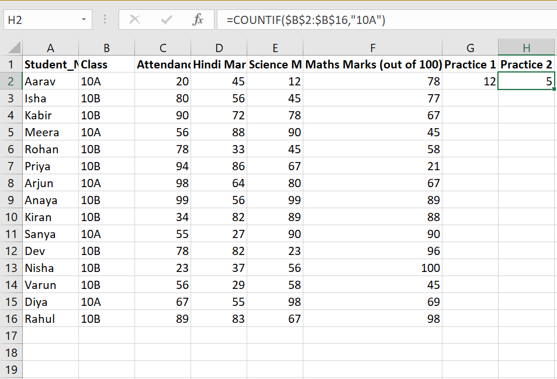

## COUNTIFS

Definition: The COUNTIFS function in Excel counts the number of cells that meet multiple specified conditions. It is useful when you want to count entries based on more than one criterion.

Syntax:
=COUNTIFS(criteria_range1, criteria1, [criteria_range2, criteria2], …)

- criteria_range1 – The first range to evaluate the condition on.
- criteria1 – The condition that determines which cells in criteria_range1 to count.
- criteria_range2, criteria2, … – Additional ranges and conditions (optional).

Example:
=COUNTIFS(B2:B11, ">=80", D2:D11, "Pass")

Practice: 1) Count the number of students who scored at least 50 in Maths and have attendance ≥ 75%.

Practice: 2) Count the number of students who scored ≥ 60 in Science and belong to class "10A".

[Open COUNTIFS_examples Sheet in Excel](../excel_files/formula_examples.xlsx)
> After opening, go to the sheet named `COUNTIFS_examples` to see the formulas.

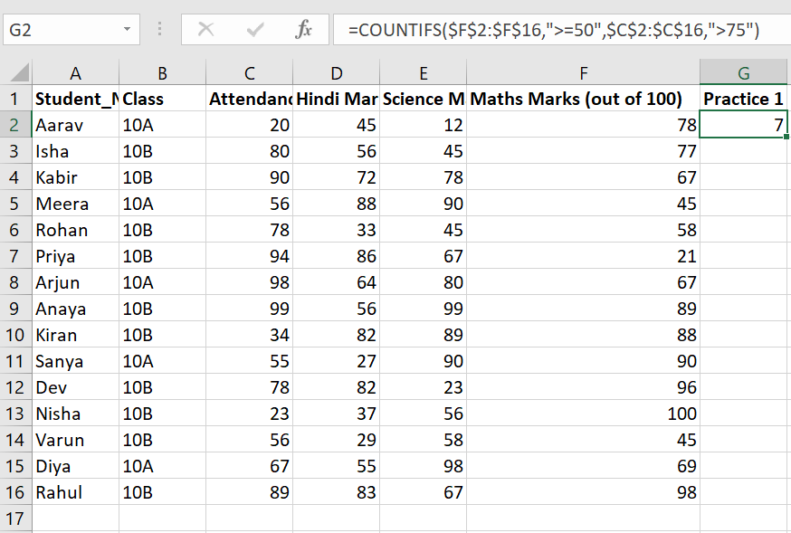
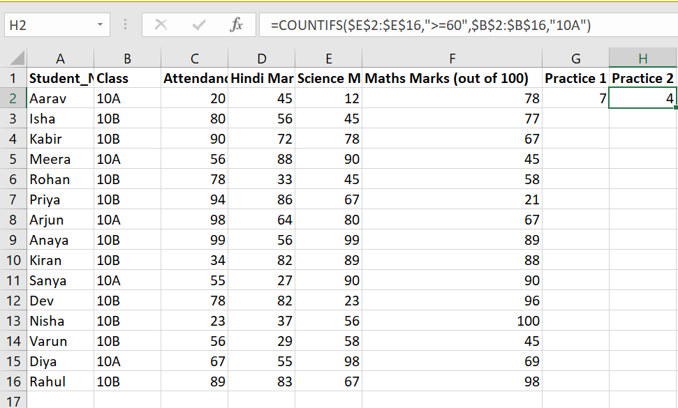