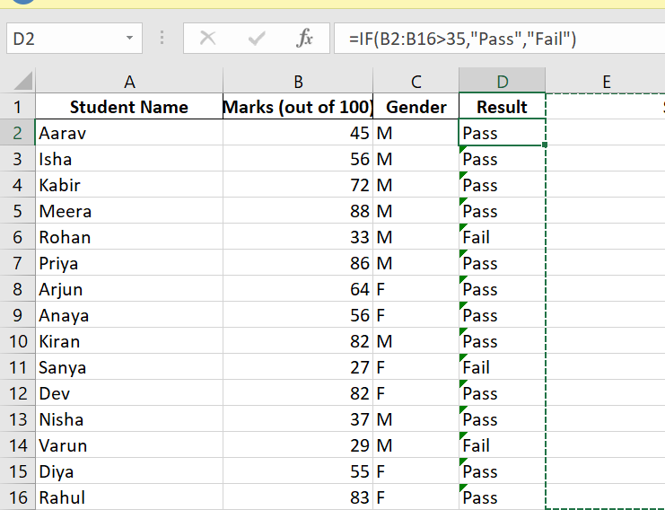
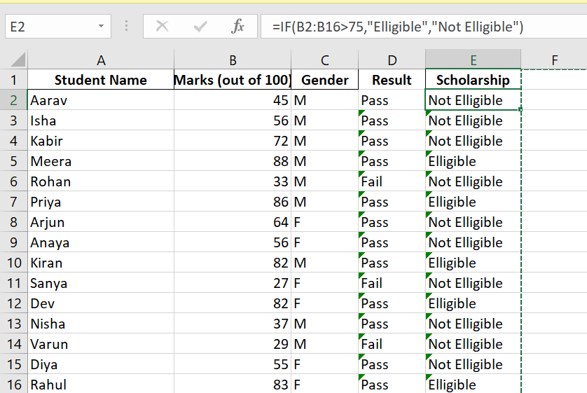
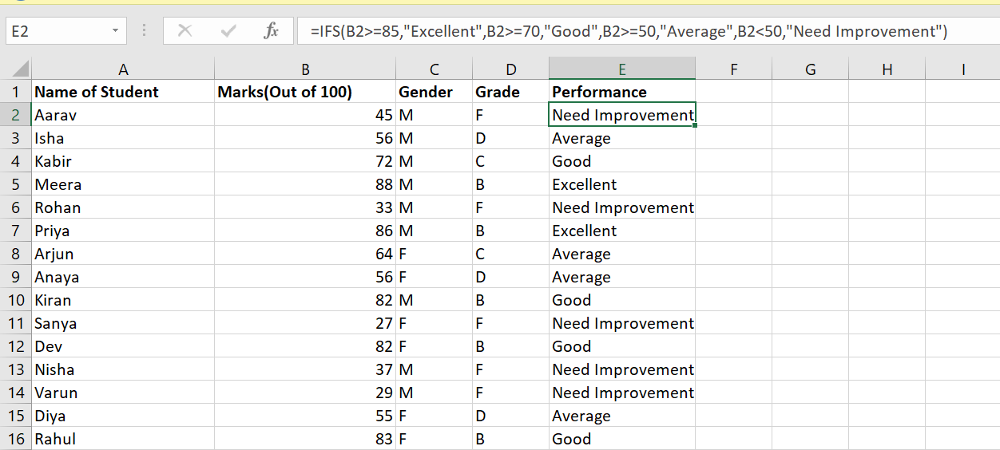
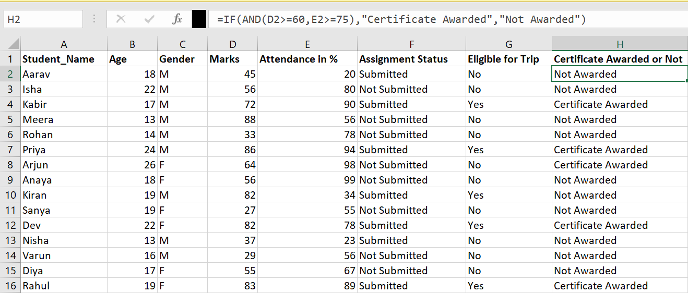

## IF
Definition: The IF function in Excel is a logical function that checks whether a condition is TRUE or FALSE, and then returns one value if the condition is TRUE and another value if the condition is FALSE.
Syntax: =IF(logical_test, value_if_true, value_if_false)
Example: =IF(C2>=50,"Pass","Fail")
Practice: 1) Create Pass/Fail column for students.
Practice: 1) Create Scholarship column for students who scored >=80  marks in exam.

[Open IF_examples Sheet in Excel](../excel_files/formula_examples.xlsx)
> After opening, go to the sheet named `IF_examples` to see the formulas.

## IFS
Definition: The IFS function in Excel evaluates multiple conditions in the order they are written and returns a value corresponding to the first TRUE condition. It is useful when you have more than one condition to test, instead of nesting multiple IF statements.

Syntax: 
=IFS(condition1, value_if_true1, condition2, value_if_true2, ..., TRUE, value_if_false)

Example: 
=IFS(C2>=90,"A", C2>=75,"B", C2>=60,"C", C2>=50,"D", TRUE,"F")

Practice: 1) Create a Grade column for students based on their marks:
- Marks >= 90 → "A"
- Marks >= 75 → "B"
- Marks >= 60 → "C"
- Marks >= 50 → "D"
- Marks < 50 → "F"

Practice: 2) Create a Performance column for students:
- Marks >= 85 → "Excellent"
- Marks >= 70 → "Good"
- Marks >= 50 → "Average"
- Marks < 50 → "Needs Improvement"

[Open IFS_examples Sheet in Excel](../excel_files/formula_examples.xlsx)
> After opening, go to the sheet named `IFS_examples` to see the formulas.

## AND

Definition: The AND function in Excel is a logical function that checks whether all conditions are TRUE. It returns TRUE if all conditions are met, and FALSE if any condition is not met.

Syntax: =AND(logical1, logical2, …)

Example: =AND(C2>=50, D2="Yes")

Practice: 1) Create a column that shows Eligible only if a student scored at least 50 marks and has submitted the assignment.

Practice: 2) A school wants to check if students are eligible for a certificate.
- Student must score at least 60 marks.
- Student must have attendance ≥ 75%.
If both conditions are met, display "Certificate Awarded", otherwise display "Not Awarded".

[Open AND_examples Sheet in Excel](../excel_files/formula_examples.xlsx)
> After opening, go to the sheet named `AND_examples` to see the formulas.

